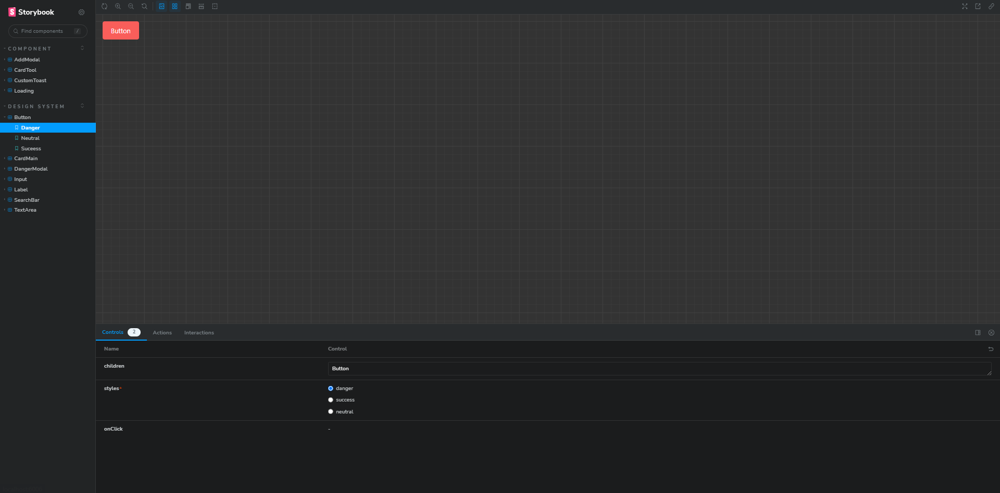

Desafio Kennedy
-
Projeto desenvolvido para o desafio da Kennedy.

## Tecnologias utilizadas
<p align="center">
  
</p> 

- React Icons 
- React Modal
- React Toastify
- Axios
- Storybook
- Yup
- Eslint

## Acessar o projeto
-> [Desafio Kennedy](https://desafio-kennedy.vercel.app/) 

## Como executar o projeto
```bash
# clonar repositório
git clone https://github.com/LucianoASousa/Desafio-Kennedy.git

# instalar dependências
yarn install

# criar arquivo .env e adicionar a variável de ambiente VITE_API_URL

# executar o projeto
yarn dev

# o projeto será executado na porta:5173 - acesse http://localhost:5173
```

## Como executar o storybook
```bash
# executar o storybook
yarn storybook

# o storybook será executado na porta:6006 - acesse http://localhost:6006
```


## Como executar o projeto com container
>Para executar o projeto com container é necessário ter o docker e o docker-compose instalado na máquina.
```bash
# execute 
sudo apt-get install docker docker-compose
```

>Mude o valor da variável de ambiente `VITE_API_URL` no docker-compose.yml

```bash
# executar o projeto
docker-compose up

# o projeto será executado na porta:5173 - acesse http://localhost:5173
```

## Como executar os testes
>Os testes foram feitos utilizando o vitest e testing-library para testar os componentes.
>

```bash
# executar os testes 
yarn test
```
>Você será direcionado para o navegador para ver os testes.

## Executando eslint
```bash
# executar o eslint
yarn lint
```

## Explicando a utilização das tecnologias

### React
>React é uma biblioteca JavaScript que mistura HTML com JavaScript, permitindo a criação de componentes reutilizáveis.

### React Icons
>Utilizei o react icons para ter acesso a diversos ícones usansdo como componentes.

### React Modal
>Utilizei o react modal para criar os modais de adicionar de excluir.

### React Toastify
>Utilizei o react toastify para criar as notificações.

### Tailwindcss
>Utilizei o tailwindcss para criar os estilos do projeto, acho uma otima ferramenta para criar estilos de forma rápida.

### Axios
>Utilizei o axios para fazer as requisições para a api.

### Typescript
>Utilizei o typescript para ter acesso a tipagem e ter um código mais limpo.

### Storybook
>Utilizei o storybook para documentar os componentes.

### Yup
>Utilizei o yup para fazer a validação dos campos.

### Eslint
>Utilizei o eslint para manter o padrão de código.

# Telas:

### Tela de Login:


### Tela de Dashboard:


### Tela de Adicionar Ferramentas:


### Tela de Remover Ferramentas:

